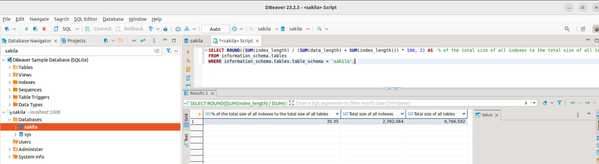
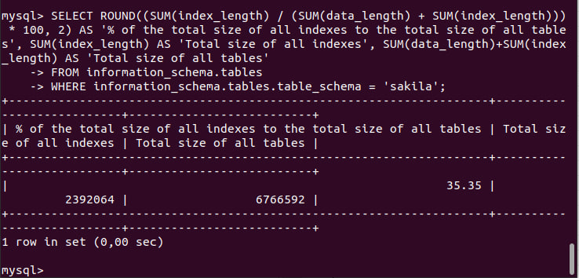
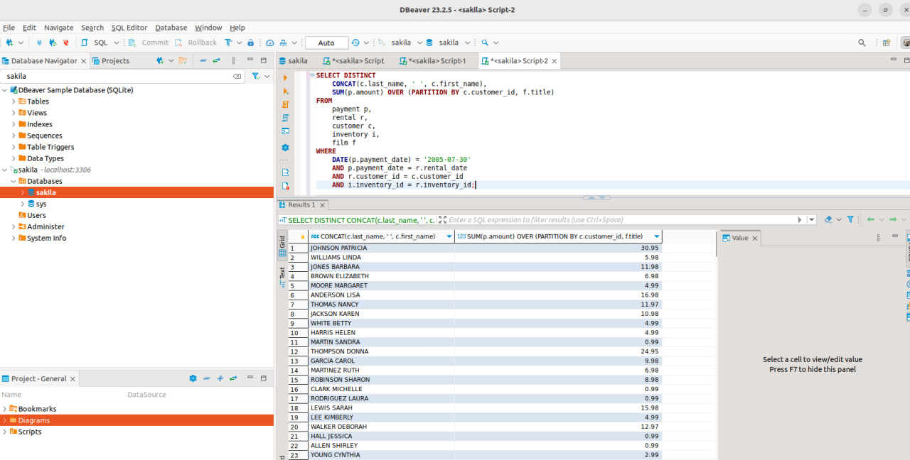
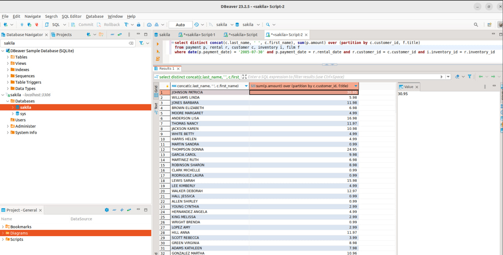
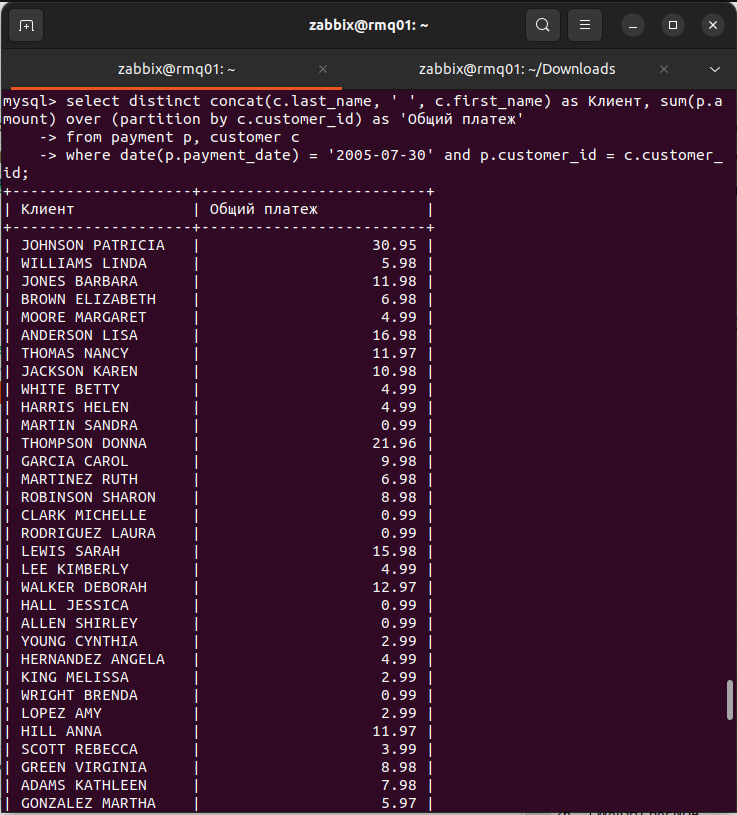
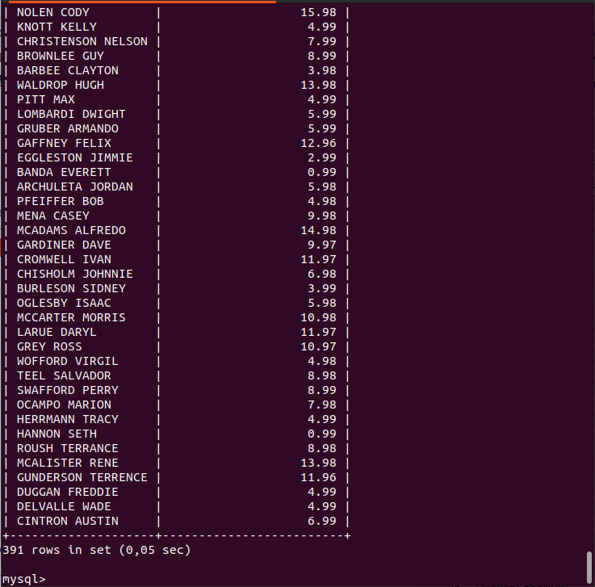
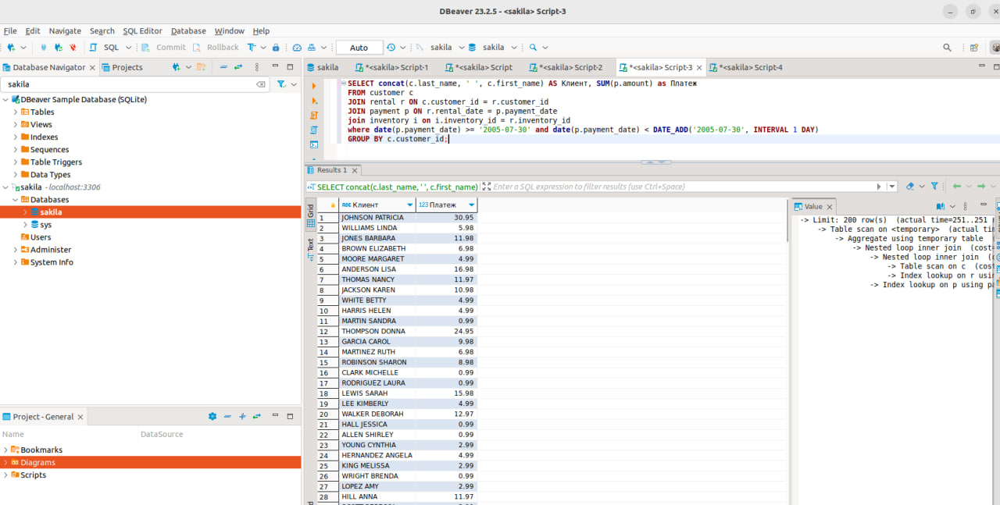
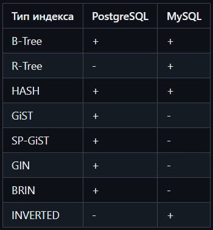

# 12.5 Индексы - Хомяков Антон.

### Задание 1

Напишите запрос к учебной базе данных, который вернёт процентное отношение общего размера всех индексов к общему размеру всех таблиц.

#### *Решение:*
```sql
SELECT ROUND((SUM(index_length) / (SUM(data_length) + SUM(index_length))) * 100, 2) AS '% of the total size of all indexes to the total size of all tables', SUM(index_length) AS 'Total size of all indexes', SUM(data_length)+SUM(index_length) AS 'Total size of all tables'
FROM information_schema.tables
WHERE information_schema.tables.table_schema = 'sakila';
```


---

### Задание 2

Выполните explain analyze следующего запроса:
```sql
SELECT DISTINCT 
    CONCAT(c.last_name, ' ', c.first_name), 
    SUM(p.amount) OVER (PARTITION BY c.customer_id, f.title)
FROM 
    payment p, 
    rental r, 
    customer c, 
    inventory i, 
    film f
WHERE 
    DATE(p.payment_date) = '2005-07-30'
    AND p.payment_date = r.rental_date
    AND r.customer_id = c.customer_id
    AND i.inventory_id = r.inventory_id;
```


- перечислите узкие места;
- оптимизируйте запрос: внесите корректировки по использованию операторов, при необходимости добавьте индексы.

#### *Решение:*

### Explain analyze
Я выбрал другой подход — вместо создания дополнительных индексов (что заняло бы лишнее время), решил просто убрать избыточные части запроса, как рекомендовали на вебинаре.
В итоге получился вот такой вариант:
```
select distinct concat(c.last_name, ' ', c.first_name) as Клиент, sum(p.amount) over (partition by c.customer_id) as 'Общий платеж'
from payment p, customer c
where date(p.payment_date) = '2005-07-30' and p.customer_id = c.customer_id;
```
Cкриншот оптимизированного запроса:




---

### Узкие места
```
-> Limit: 200 row(s)  (cost=0..0 rows=0) (actual time=39.8..40.5 rows=200 loops=1)
    -> Table scan on <temporary>  (cost=2.5..2.5 rows=0) (actual time=39.8..40.2 rows=200 loops=1)
        -> Temporary table with deduplication  (cost=0..0 rows=0) (actual time=39.8..39.8 rows=391 loops=1)
            -> Window aggregate with buffering: sum(payment.amount) OVER (PARTITION BY c.customer_id )   (actual time=37.2..39.3 rows=634 loops=1)
                -> Sort: c.customer_id  (actual time=37.1..37.6 rows=634 loops=1)
                    -> Stream results  (cost=7263 rows=16086) (actual time=0.176..36.5 rows=634 loops=1)
                        -> Nested loop inner join  (cost=7263 rows=16086) (actual time=0.166..35.3 rows=634 loops=1)
                            -> Filter: (cast(p.payment_date as date) = '2005-07-30')  (cost=1633 rows=16086) (actual time=0.139..30.9 rows=634 loops=1)
                                -> Table scan on p  (cost=1633 rows=16086) (actual time=0.0675..17.1 rows=16044 loops=1)
                            -> Single-row index lookup on c using PRIMARY (customer_id=p.customer_id)  (cost=0.25 rows=1) (actual time=0.00259..0.00336 rows=1 loops=634)
```

Как видно из анализа, узкие места обозначены здесь: 
```
Temporary table with deduplication  (cost=0..0 rows=0) (actual time=39.8..39.8 rows=391 loops=1)
Table scan on p - Прямо говорит: "Я читаю всю таблицу payment". Это много строк: 16086 записей прочитаны, чтобы выбрать 634.
Window aggregate with buffering: sum(payment.amount) OVER (PARTITION BY c.customer_id )   (actual time=37.2..39.3 rows=634 loops=1) - Оконная функция SUM(...) OVER (...) требует буферизации и сортировки (Sort: c.customer_id), что нормально, но становится дорогим при больших выборках.
Sort: c.customer_id  (actual time=37.1..37.6 rows=634 loops=1)
```
Использование оконной функции увеличивает количество строк, плюс сортировка по двум параметрам. Удаление повторяющихся строк из-за оконной функции. Плюс лишняя таблица film.

---
### Оптимизация запроса. Новый вариант
Создан индекс для даты платежа
```sql
create index day_of_payment on payment(payment_date);
```

Переделан запрос с объединением таблиц. Таблица film не используется.
```sql
SELECT concat(c.last_name, ' ', c.first_name) AS Клиент, SUM(p.amount) as Платеж
FROM customer c
JOIN rental r ON c.customer_id = r.customer_id 
JOIN payment p ON r.rental_date = p.payment_date 
join inventory i on i.inventory_id = r.inventory_id 
where date(p.payment_date) >= '2005-07-30' and date(p.payment_date) < DATE_ADD('2005-07-30', INTERVAL 1 DAY)
GROUP BY c.customer_id;

-> Limit: 200 row(s)  (actual time=251..251 rows=200 loops=1)
    -> Table scan on <temporary>  (actual time=251..251 rows=200 loops=1)
        -> Aggregate using temporary table  (actual time=251..251 rows=391 loops=1)
            -> Nested loop inner join  (cost=11807 rows=17135) (actual time=0.681..246 rows=642 loops=1)
                -> Nested loop inner join  (cost=5810 rows=16424) (actual time=0.262..87.1 rows=16044 loops=1)
                    -> Table scan on c  (cost=61.2 rows=599) (actual time=0.0988..1.25 rows=599 loops=1)
                    -> Index lookup on r using idx_fk_customer_id (customer_id=c.customer_id)  (cost=6.86 rows=27.4) (actual time=0.118..0.139 rows=26.8 loops=599)
                -> Index lookup on p using payment_index (payment_date=r.rental_date), with index condition: (cast(p.payment_date as date) = '2005-07-30')  (cost=0.261 rows=1.04) (actual time=0.00934..0.00943 rows=0.04 loops=16044)
```
Вывод анализа. Скорость обработки с индексом стала еще быстрее по сравнению с самым первым вариантом.


---

### Дополнительные задания (со звёздочкой*)

Эти задания дополнительные, то есть не обязательные к выполнению, и никак не повлияют на получение вами зачёта по этому домашнему заданию. Вы можете их выполнить, если хотите глубже шире разобраться в материале.
### Задание 3*

Самостоятельно изучите, какие типы индексов используются в PostgreSQL. Перечислите те индексы, которые используются в PostgreSQL, а в MySQL — нет.

Приведите ответ в свободной форме.

### *Решение:*

Сравнительная таблица используемых индексов:




